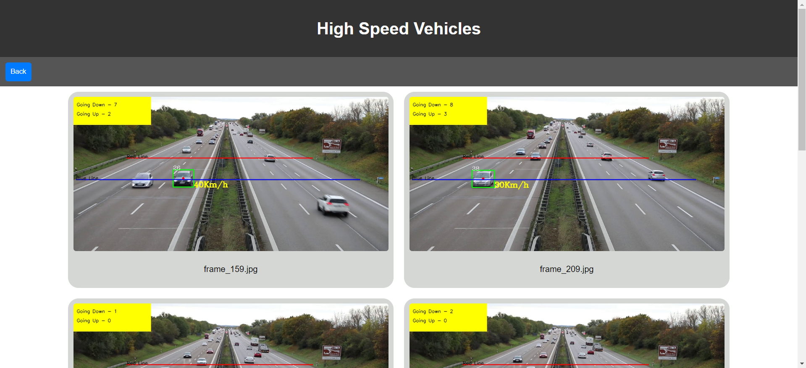

# Vehicle Speed Detection

Vehicle Speed Detection is a project designed for real-time traffic footage processing with an interactive web UI.

## Features

-   Real time video processing
-   Interactive web ui

## Installation

-   Python dependencies: `cv2`, `ultralytics`.
-   To install Node.js dependencies, run `npm install` in the root project directory.
-   Note: First execution will take time to download YOLO model.

## Usage

Authorities such as traffic departments can effortlessly upload traffic footage. The program automatically identifies frames where vehicles exceed speed limits, presenting them via a user-friendly web interface.

## Screenshots

_Upload Video_

_Output_

## Contributing

We welcome contributions! Please fork the repository and submit pull requests with your enhancements.

## License

This project is licensed under the [MIT License](LICENSE).
